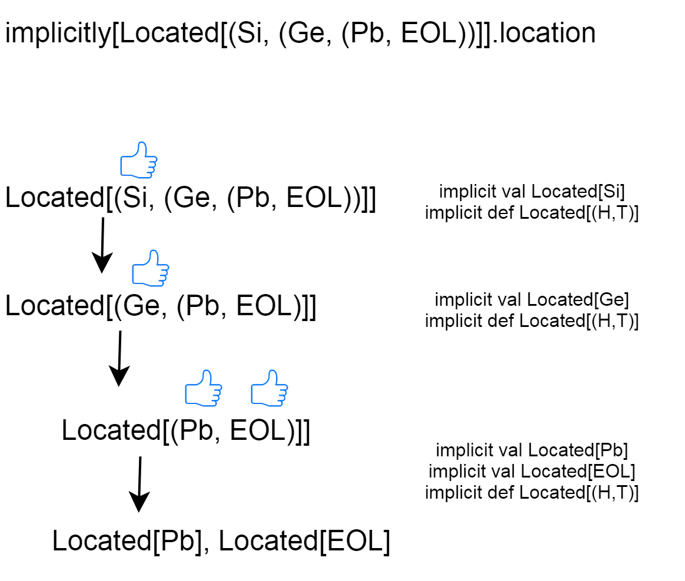

class: middle, center

# Implicit Typeclass Induction 
### with Scala

Florian Baierl 2018

---
class: middle, center

# Agenda 

.left[
- Basics I: Implicits (& Quiz I) 

- Basics II: Typeclasses (& Quiz II) 

- (Basics III: Induction)

- The cool part: Typeclass induction (& Quiz III) 

]
---
class: middle center

## Basics I: Implicits 

---
class: middle

What are implicits?

```scala
implicit val x = 10
```

---
class: middle

The _implicitly_ keyword:

```scala
implicit val x = 10
implicit val y = "20"

println(implicitly[Int]) // 10
```

---
class: middle

How are implicit paramters used?

```scala
def printNumber(implicit x: Int): Unit = println(x)

implicit val x: Int = 10

printNumber    // 10
printNumber(x) // 10
```

---
class: middle center

### What are implicit type converters?

---
class: middle

```scala
1: // ???
2: val x: Int = 42.2 // doesn't work
```

What can I write on line 1 to make this work?

---
class: middle

```scala
1: implicit def doubleToInt(d: Double): Int = d.toInt // put this anywhere in scope
2: val x: Int = 42.2 // works, x == 42
```

Actually this is happening: 

```scala
2: val x: Int = doubleToInt(42.2) 
```

---
class: middle

### "Retrofitting" existing or new objects with iplicit type converters

One of two ways of retrofitting existing or new types (other one is type classes).

```scala
trait Quantifiable { def quantify: Int }

implicit def string2quant(s: String) = new Quantifiable{ 
  def quantify = s.size 
}

implicit def list2quantifiable[A](l: List[A]) = new Quantifiable{ 
  val quantify = l.size 
}
```

---
class: middle

Now we can call:

```scala
val list = List(1,2,3)
val string = "Hello World!"

list.quantify   // 3
string.quantify // 12 
```

---
class: middle

## A real life example (taken from Bor)

In _gallium.models_:

```scala
case class GeResource(id: String, kind: String, properties: Map[String, String])
```

In _bor_:
```scala
trait GeResourceSyntax  {
  implicit final def toResourceOps(res: GeResource): GeResourceOps = new GeResourceOps(res)
}

final class GeResourceOps(private val res: GeResource) extends AnyVal {

	def toStation: UnableToParseGeResourceError Either FleetViewStation = ???
	def toProduct: UnableToParseGeResourceError Either production.Product = ???
	def toProductType: UnableToParseGeResourceError Either production.ProductType = ???
}
```

---
class: middle center

## Another use case in Bor
---

class: middle

```scala
import scala.collection.generic.CanBuildFrom
import scala.language.higherKinds
import scala.language.implicitConversions

trait EitherTraversableSyntax  {
  implicit def toEitherListOps[A, B, CC[X] <: Traversable[X]] 
  (l: CC[Either[A, B]]): EitherTraversableOps[A, B, CC] =
    new EitherTraversableOps(l)
}

final class EitherTraversableOps[A, B, CC[X] <: Traversable[X]](private val l: CC[Either[A, B]]) extends AnyVal {
  /**
    * alternative syntax of [[com.kuka.cc.b.core.syntax.EitherTraversableOps#splitEithers]]
    * (\/ is an either in scalaz, so \∨/ 'splits' multiples of it)
    */
  def \∨/(implicit bfa: CanBuildFrom[Nothing, A, CC[A]],
          bfb: CanBuildFrom[Nothing, B, CC[B]]): (CC[A], CC[B]) = splitEithers

  /**
    * Splits this Traversable (CC[X]) of Eithers into a tuple with (CC[lefts], CC[rights])
    */
  def splitEithers(implicit bfa: CanBuildFrom[Nothing, A, CC[A]],
                   bfb: CanBuildFrom[Nothing, B, CC[B]]): (CC[A], CC[B]) = {
    def lefts: CC[A] = // ...
    def rights: CC[B] = // ...
    (lefts, rights)
  }
}
```


---
class: middle

## Quiz I: What does this output?

```scala
object Whatever{
	def speak(something: String)(implicit nice: String)={
		println(s"$something $nice")
	}
}

implicit val nice= "the walrus"

println{ Whatever.speak("I am") }
println{ Whatever.speak("I like")("catfood") }
```

---
class: middle

## Solution I: 
### "I am the walrus"
### "I like catfood" 


---
class: middle center

## Basics II: Typeclasses

---
class: middle

- Type classes are a powerful and flexible concept that **adds ad-hoc polymorphism** to Scala. They are not a first-class citizen in the language, but other built-in mechanisms allow writing them in Scala. 

- Type class is a class (group) of types, which satisfy some contract defined in a trait with addition that such functionality (trait and implementation) can be added without any changes to the original code (without extending)

---
class: middle

### Example: Semigroup

One simple example of a Typeclass: Semigroup

> In mathematics, a semigroup is an algebraic structure consisting of a set together with an associative binary operation.

- e.g. cats.Semigroup

A semigroup for some given type A has a single operation (combine), which takes two values of type A, and returns a value of type A. 

```scala
package cats.kernel

trait Semigroup[A] {
  
  def combine(x: A, y: A): A

  // ...
}
```

---
class: middle

cats also offers some nice syntax for using Semigroups:

```scala
import cats.implicits._

1 |+| 2 // 3

// ---

val map1 = Map("hello" -> 0, "world" -> 1)
val map2 = Map("hello" -> 2, "cats"  -> 3)

map1 |+| map2 // Map(hello -> 2, cats -> 3, world -> 1)

// ---

case class Error()

val oneOrError: Error Either Int = Right(1)
val twoOrError: Error Either Int = Left(Error())

oneOrError |+| oneOrError // Right(2)
twoOrError |+| oneOrError // Left(Error())
```

---
class: middle

### Quiz II: What should this be?

```scala
import cats.implicits._

Semigroup[Int => Int].combine(_ + 1, _ * 10).apply(6) should be ??

// equal: Semigroup[Int => Int].combine(x => x + 1, x => x * 10)
```

---
class: middle
### Solution II: 67

Note, that this differs from:

```scala
val f1: Int => Int = x => x + 1
val f2: Int => Int = x => x * 10
val f3: Int => Int = f1 andThen f2

f3(6) // 70
```    

---
class: middle

How can we extend that mechanism to also include Option\[A\] (cats supports this out-of-the-box)?  

"If I have a *Semigroup of Type A*, Scala should produce for me a *Semigroup for Option[A]*:

```scala
implicit def optionSemigroup[A](implicit s: Semigroup[A]): Semigroup[Option[A]] =
	new Semigroup[Option[A]] {
  def combine (oa1: Option[A], oa2: Option[A]): Option[A] = for {
    a1 <- oa1
    a2 <- oa2
  } yield s.combine(a1, a2)
}

```

One thing that you can achieve with type classes and not with implicit conversions is adding properties to a type, rather than to an instance of a type. 

---
class: middle

### Other Typeclasses:

- **Monoid**  
> _"Semigroup + empty value"_
- **Functor**
> _"Stuff that can be mapped over"_
- **Applicative**
> _"Functor + ap method (map + product method) + pure method (wraps value into a type constructor)"_
- **Monad**
> _"Applicative + flatten method"_
- ...

.footnote[

See: https://typelevel.org/cats/typeclasses.html]

---
class: middle center
## Basics III: Induction

---
class: middle
 
### What is Induction?
 
A way of proofing that a property P(n) holds for every natural number n, i.e. for n = 0, 1, 2, 3, etc.

- base case (0)
- induction step (n+1)


---
class: middle center

## The cool part: Typeclass induction

### Can we leverage __implicit resolution__ to do __typeclass induction__?

---
class: middle

### Some Preparation
#### 1. a custom-made list

```scala
case class Si()
case class Ge()
case class Pb()

type EOL = ()

(Ge, (Si, (Pb, EOL)))
```

Let's call this `(_, (_, (_, EOL))` tuple-list.

---
class: middle

#### 2. a typeclass: Located[A]

```scala
trait Located[A] { val location: String }

implicit val locatedSi = new Located[Si] { val location = "agv"  }
implicit val locatedGe = new Located[Ge] { val location = "plan" }
implicit val locatedPb = new Located[Pb] { val location = "plc"  }
```

---
class: middle

#### 3. goal

A list of locations for _any_ tuple-list

```scala
Located[(Si, (Ge, (Pb, EOL))].location // should print: "agv, plan, plc"
```

---
class: middle center

## How? Typeclass induction!

---
class: middle 

### 1. base case

```scala
trait Located[A] { val location: String }

implicit val base: Located[EOL] = new Located[EOL] {
  val location = ""
}
```

---
class: middle

### 2. induction step

```scala
trait Located[A] { val location: String }

// notice: this is a implicit *method*
// if I have a Located H and a Located T
// produce a Located for the tuple of H and T
implicit def inductionStep[H, T] (implicit locatedHead: Located[H], locatedTail: Located[T]): Located[(H, T)] =
  new Located[(H,T)]  {
    val location = s"${locatedHead.location}, ${locatedTail.location}"
  }

```

---
class: middle

## And it's done! 

```scala
implicitly[Located[(Si, (Ge, (Pb, EOL))]].location
// "agv, plan, plc, " 

implicitly[Located[(Si, (Ge, (Pb, (Pb, (Ge, (Si, EOL))))))]].location
// "agv, plan, plc, plc, plan, agv, " 
```

Close enough!

---
class: middle

## How it works



---
class: middle, center

## Quiz III: How can we remove the trailing comma?

---
class: middle

## Solution III

```scala
implicit def inductionStep[H, T] (implicit locatedHead: Located[H], locatedTail: Located[T]): Located[(H, T)] =
  new Located[(H,T)]  {
    val location: String =
      locatedHead.location +
      (if(locatedTail.location != "") ", " else "") +
      locatedTail.location
  }
```

---
class: middle center

### Thanks you for your attention!
## Questions?